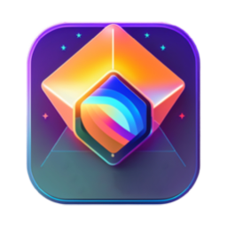
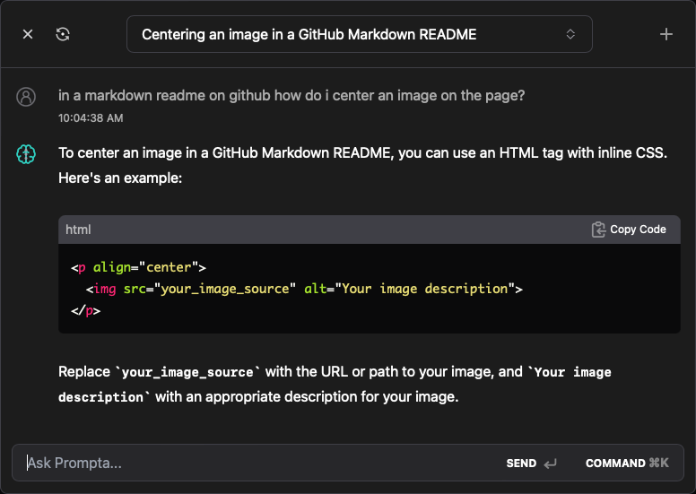
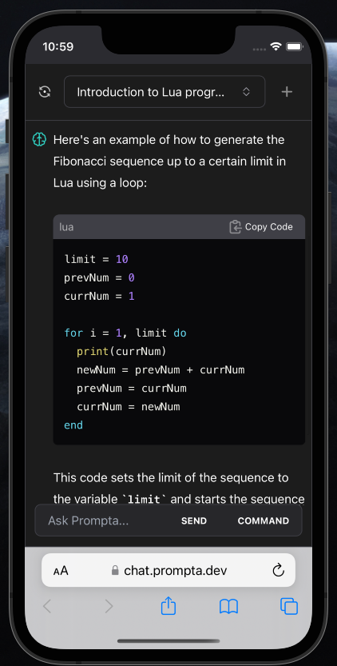
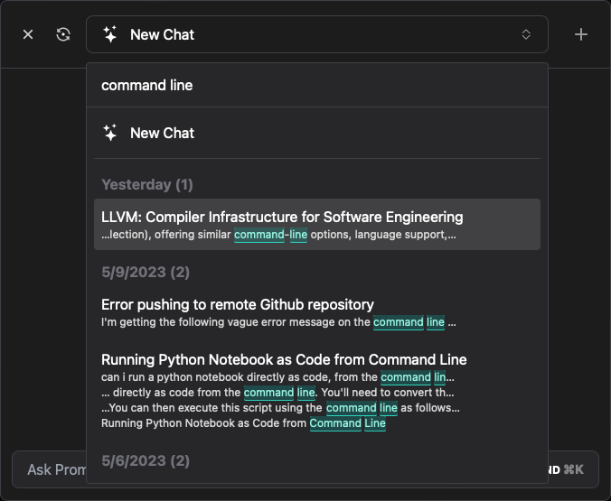
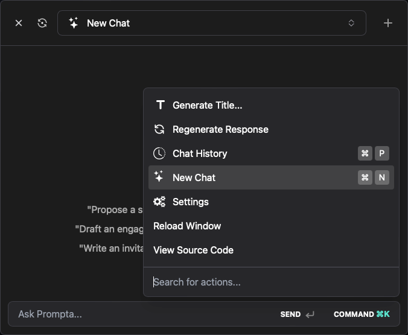
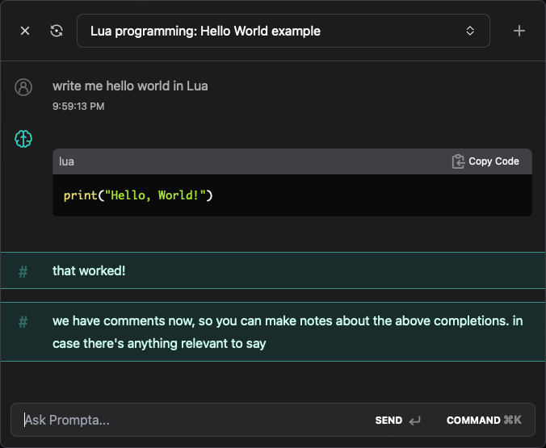

<!-- display a screenshot -->
<div align="center">

[](https://www.prompta.dev)<br>

# Prompta

Yet another interface for chatting with ChatGPT (or GPT-4).

[Website](https://www.prompta.dev)
| [Downloads](releases)
| [Launch App](https://chat.prompta.dev)

</div>

<div align="center">



</div>

| Mobile                                       | Search chats                      | Keyboard Centric                                            | Comments                                    |
| -------------------------------------------- | --------------------------------- | ----------------------------------------------------------- | ------------------------------------------- |
|  |  |  |  |

## Features

- [x] Search all previous conversations (full-text!)
- [x] Sync your chat history across devices
- [x] Keyboard centric
- [x] Leave notes on responses, such as "working code!" or "not working"
- [x] Keep all your chat history stored locally
- [x] Search previous chat threads
- [x] Chat with ChatGPT or GPT-4

## Roadmap

- [ ] Context-window compression (See #1)
- [ ] Chat history awareness (See #2)

## Developing

The following examples use `npm` but `yarn` or `pnpm` will also work:

```bash
npm install
npm run dev

# or start the server and open the app in a new browser tab
npm run dev -- --open
```

## Building

To create a production version of your app:

```bash
npm run build
```

You can preview the production build with `npm run preview`.

## Releasing a new Version

```bash
npm run release
```

You will be prompted to enter a new version number. New versions that don't contain a suffix such as `-beta` or `-alpha` will be published to GitHub.

## Built With

- [SQLite](https://www.sqlite.org/index.html) via [vlcn/cr-sqlite](https://vlcn.io/) - SQLite compiled to WASM running in the browser using CRDTs for conflict-free replication.
- [Tauri](https://tauri.studio) - A Rust-based alternative to Electron (Only used in desktop builds)
- [Svelte](https://svelte.dev) - Reactive UI framework
