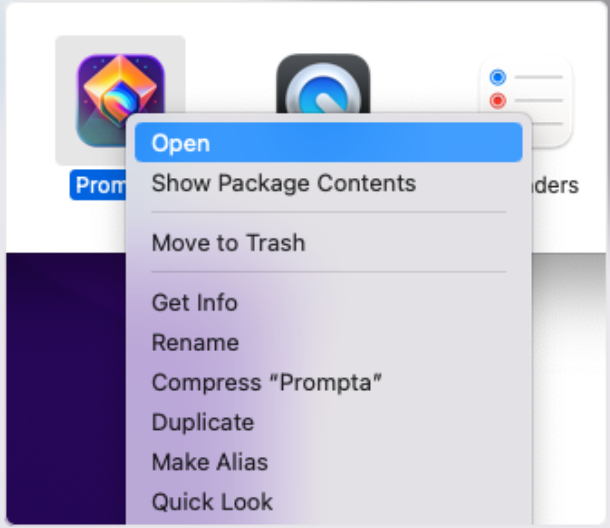
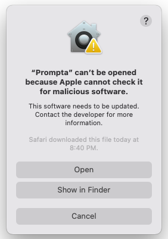

<!-- display a screenshot -->
<div align="center">

[](https://www.prompta.dev)<br>

# Prompta

</div>

> [!NOTE] > **This project is no longer maintained.**
>
> [Raycast recently announced](https://www.raycast.com/changelog/1-100-0) that you can bring your own API key. Raycast offers a much more polished and actively maintained interface for chatting with LLMs. This change fully addresses the original problem that Prompta was designed to solve.
>
> I created Prompta to solve my own need: a fast, keyboard-centric way to chat with LLMs using my own API key. For many months, it was my primary AI chat app and it was a joy to build something that solved my own problem and was useful to others.
>
> For that reason, I've decided to archive the project. The code will remain available on GitHub and the [web app](https://chat.prompta.dev) will stay online, but I will no longer be working on it.
>
> Thank you to everyone who used the app, filed issues, and provided feedback. If you're interested in taking over the project, please feel free to reach out.

---

Yet another interface for chatting with LLMs via API.

[Website](https://www.prompta.dev)
| [Downloads](https://github.com/iansinnott/prompta/releases)
| [Launch App](https://chat.prompta.dev)

<div align="center">


</div>

| Mobile                                       | Search chats                      | Keyboard Centric                                            | Comments                                    |
| -------------------------------------------- | --------------------------------- | ----------------------------------------------------------- | ------------------------------------------- |
|  |  |  |  |

## Features

- [x] Search all previous conversations (full-text!)
- [x] Sync your chat history across devices
- [x] Keyboard centric
- [x] Leave notes on responses, such as "working code!" or "not working"
- [x] Keep all your chat history stored locally
- [x] Search previous chat threads
- [x] Chat with the latest models (updated dynamically)
- [x] Use local LLMs like Llama, Mistral, etc
- [x] Customize the system message

## How to use

- In your web browser: [chat.prompta.dev](https://chat.prompta.dev)
- Desktop app: download the latest build from [the releases page](https://github.com/iansinnott/prompta/releases)

### Running on macOS

For macOS users you will need to right-click the app and select "Open" the first time you run it. This is because the app is signed but not notarized.

| Right-click to open                           | Now you can click "Open"                      |
| --------------------------------------------- | --------------------------------------------- |
|  |  |

## Developing

`bun` is used for development. You cam try using `yarn`, `bun`, `npm`, etc but other package managers have not been tested and are not deliberately supported:

```bash
bun install
bun run dev

# To devlop the Tuari desktop app as well:
bun run dev:tauri
```

## Building

To create a production version of your app:

```bash
bun run build
```

If you want to build only for the browser, ignoring the desktop app:

```bash
bun run ui:build-static
```

The advantage here is that you don't need any Rust dependencies which are required for building Tauri.

## Releasing a new Version

```bash
bun run release
```

You will be prompted to enter a new version number. New versions that don't contain a suffix such as `-beta` or `-alpha` will be published to GitHub.

## Built With

- [SQLite](https://www.sqlite.org/index.html) via [vlcn/cr-sqlite](https://vlcn.io/) - SQLite compiled to WASM running in the browser using CRDTs for conflict-free replication.
- [Tauri](https://tauri.studio) - A Rust-based alternative to Electron (Only used in desktop builds)
- [Svelte](https://svelte.dev) - Reactive UI framework
